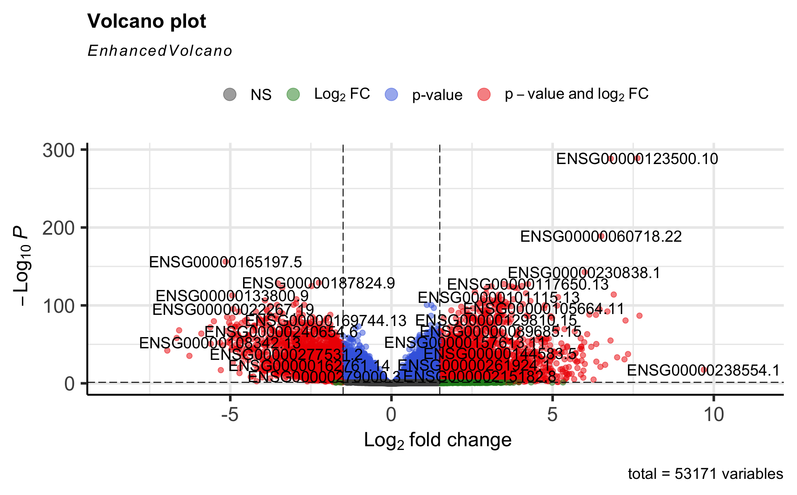
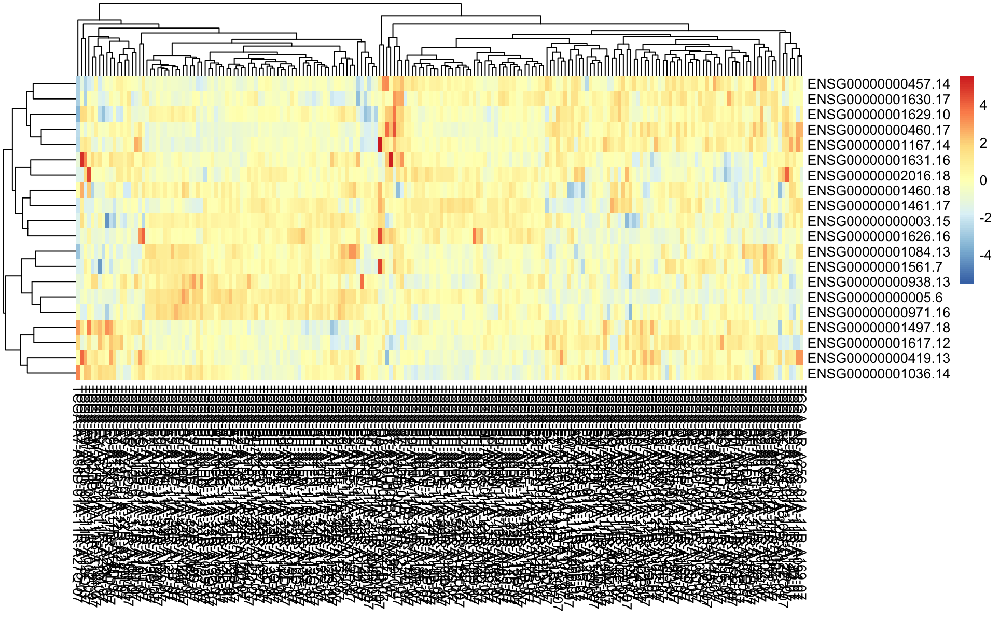
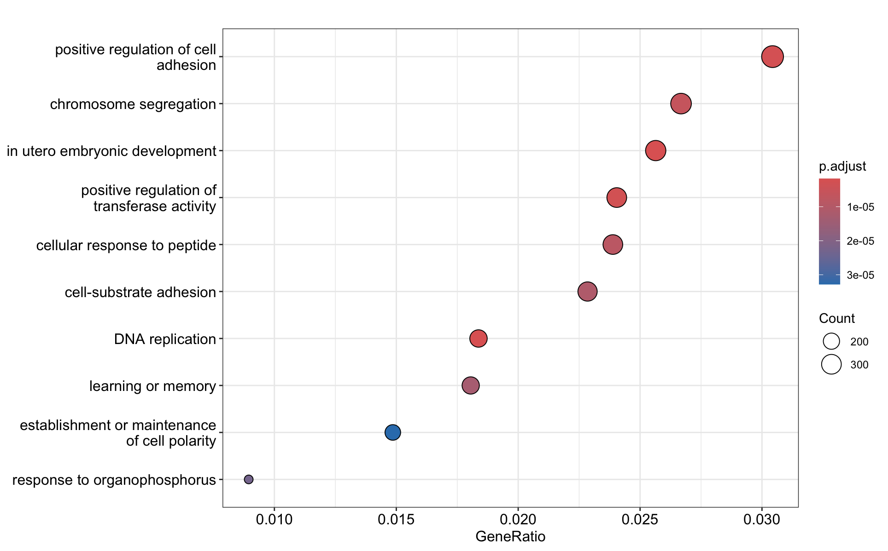

## Introduction

This report summarizes the results of an RNA-Seq differential expression analysis using publicly available data from The Cancer Genome Atlas (TCGA). The analysis pipeline involves downloading data with `TCGAbiolinks`, normalizing gene expression, identifying differentially expressed genes (DEGs), performing functional enrichment, and visualizing results.

## Methods

### Data Acquisition

-   **Source**: TCGA (The Cancer Genome Atlas)

-   **Tool**: `TCGAbiolinks` (R package)

-   **Cancer type**: BRCA(breast cancer)

-   **Sample groups**: Tumor vs. Normal tissue

### Preprocessing

-   Raw count data was filtered to remove low-expression genes.

-   Normalization was performed using the `DESeq2` variance-stabilizing transformation (VST).

### Differential Expression

-   Statistical testing for DEGs was conducted using `DESeq2`.

-   Genes with adjusted p-value \< 0.05 (Benjamini-Hochberg correction) and \|log2 Fold Change\| \> 1 were considered significant.

### Functional Enrichment

-   Significant DEGs were annotated using `clusterProfiler`.

-   Gene Ontology (GO) enrichment was performed to identify overrepresented biological processes.

## Volcano Plot

The volcano plot below shows the distribution of genes based on log₂ fold change and adjusted p-value:

```{}
```

-   Red: Genes significant in both log₂FC and p-value

-   Blue: Genes significant by p-value only

-   Green: Genes significant by log₂FC only

-   Gray: Non-significant

## Heatmap of Significant Genes

A heatmap of the top significant genes demonstrates clustering across tumor and normal samples:

```{}
```

-   Clustered gene expression of top DEGs across all samples

-   Color represents normalized expression (z-score)

-   Dendrograms indicate similarity among genes and samples

## Functional Enrichment

Gene Ontology enrichment identified several key biological processes enriched among DEGs:

```{}
```

-   X-axis: GeneRatio (ratio of DEGs in a GO term)

-   Y-axis: Top GO terms (Biological Process)

-   Dot size: Gene count

-   Dot color: Adjusted p-value

## Conclusion

This analysis successfully identified genes and biological pathways differentially regulated in tumor versus normal samples from TCGA. Enriched GO terms include processes related to cell adhesion, development, and replication, indicating potential mechanisms of tumorigenesis.

## 
